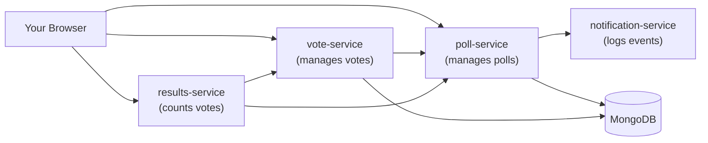

# Poll App

A microservice based polling and voting application. Create a poll, vote on
it, see live results, close it. Built to refresh cloud provisioning and
deployment concepts: Docker, Docker Compose, and Kubernetes.


the final report is in docs/delivirables.pdf
## Architecture



## Run locally with Docker Compose

```powershell
cd poll-app
docker compose up --build -d
docker compose ps
```

Open `web/index.html` in a browser to use the app.

Stop and clean up:

```powershell
docker compose down -v
```

## Deploy to Kubernetes

Build and push images:

```powershell
docker build -t skylwalker1470/poll-app-poll:latest ./poll-service
docker build -t skylwalker1470/poll-app-vote:latest ./vote-service
docker build -t skylwalker1470/poll-app-results:latest ./results-service
docker build -t skylwalker1470/poll-app-notification:latest ./notification-service

docker push skylwalker1470/poll-app-poll:latest
docker push skylwalker1470/poll-app-vote:latest
docker push skylwalker1470/poll-app-results:latest
docker push skylwalker1470/poll-app-notification:latest
```

Start a cluster and deploy:

```powershell
minikube start --driver=docker

kubectl apply -f k8s/mongo.yaml
kubectl apply -f k8s/notification.yaml
kubectl apply -f k8s/poll.yaml
kubectl apply -f k8s/vote.yaml
kubectl apply -f k8s/results.yaml

kubectl get pods
```

Force a fresh pull after pushing an updated image:

```powershell
kubectl rollout restart deployment/poll deployment/vote deployment/results deployment/notification
```

Reach the services from outside the cluster:

```powershell
kubectl port-forward service/poll-service 3000:3000
kubectl port-forward service/vote-service 3001:3001
kubectl port-forward service/results-service 3002:3002
kubectl port-forward service/notification-service 3003:3003
```

Run each in its own terminal, then open `web/index.html` in a browser.

Scale results-service:

```powershell
kubectl scale deployment/results --replicas=5
kubectl get pods -l app=results
```
